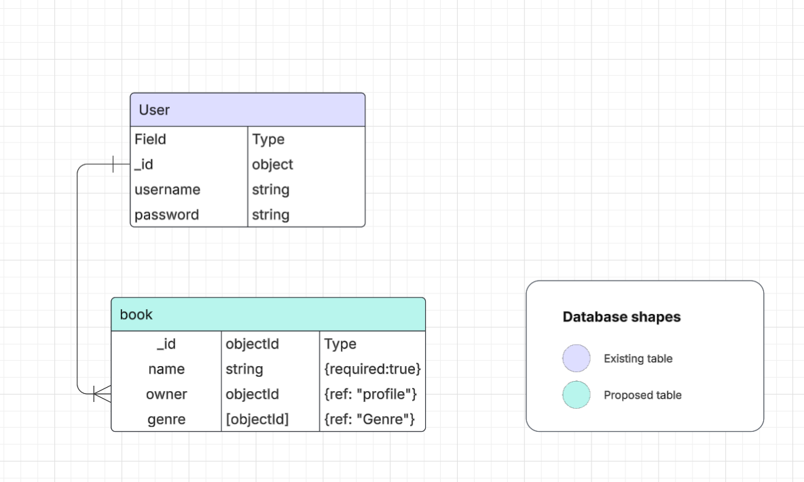
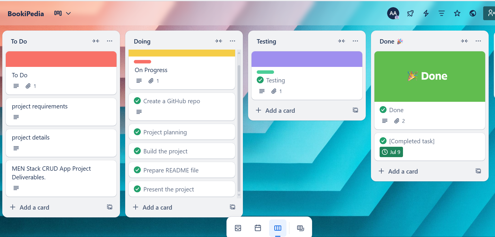
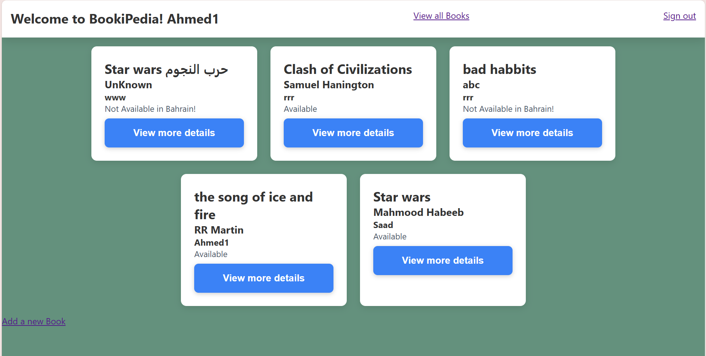
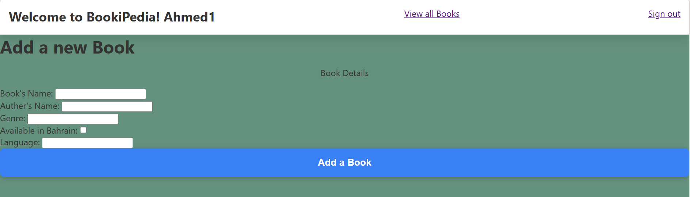

# BookiPedia 

Welcome to **BookiPedia**, a cutting-edge interactive reading platform and cloud library. This project aims to provide users with a seamless way to explore books within a clean and user-friendly interface.

## Table of Contents
- [Features](#features)
- [Technologies Used](#technologies-used)
- [Installation](#installation)
- [Project Structure](#Project-Structure)

## Features
- **Cloud Library**: Store and access your books or documents in one place.
- **Responsive Design**: Works on desktops, tablets, and mobile devices.
- **Clean UI**: Simple and appealing interface styled with a global CSS file.

## Technologies Used
- **HTML**: For structuring the web pages.
- **CSS**: For styling the interface (see `css/style.css` for global styles).
- **JavaScript**: Used for interactivity features.
- **Backend**:  MongoDB, Express, Node.js.

## Installation
Follow these steps to set up BookiPedia locally:

  **Clone the Repository**:
   ```bash
   git clone https://github.com/Alhawari80/BookiPedia.git
   cd BookiPedia


```
## Project Structure
**ERD**


## Project Plan
**Trello**



## Pages of The App








## [Live-Demo](https://bookipedia-jbya.onrender.com/)

